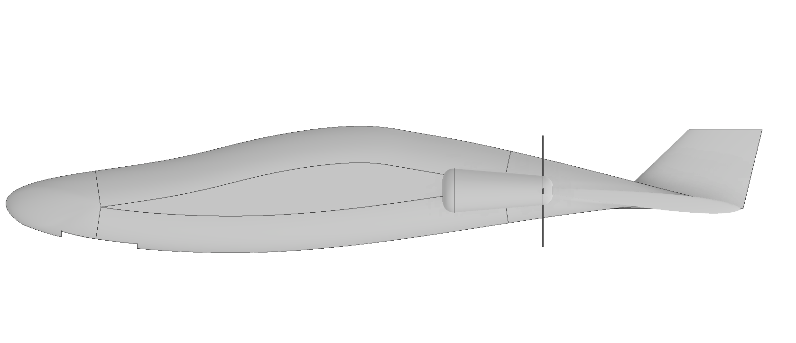

# Aerial Platform for seed dispersal
Repository for Open Drone CAD files to build an aerial platform for dispersing seeds from the air, thereby planting them. 
The platform is a Autogyros powered by two pusher propellers. We use 12S Lithium Batteries (44.4V) 10AH batteries to sustain endurance of at least an hour, carrying a payload of 20kgs.
We employ an Autogyros due to good autorotation capability and less complexity to helicopters.

Our design is currently developed using Audodesk Inventor, and is being ported to FreeCAD in due course.
In the meantime, you can build your own platform simply by using the provided PDF labeled fuselage-top-side-print as follows: 
a. Print the top and side profiles of the fuselage to your prefered scale. The provided document is 1m long approcximately. 
b. Trace out the profiles on two plywood sheets for each profle section, top and sideways, two sheets for each section. 
c. Using XPS or EPP sheets, cut out the sections using a hot wire rig using the plywood sheets as guides for our wire. These are typical Rutan-style techniques you may be
familiar with using composites. Start by cutting one side first, such as the top, then rotate the block you've  cut and apply the other side profile and you have yourself a rough fuselage.  
d. Using sand paper work on the body until it is satisfactory to you, to prime it for a layup using fiberglass or carbon fiber.  
e. Once you've done your layup, cut the fuselage in half from tail to nose and chisel away the XPS/EPP leaving a hollowed out fuselage skin.  
f. Using thing aviation-grade plywood build bulkheads to attach to the skin to provide rigidity and strength. Hard-points where motors and other critical attachments are to be made should use doublers for structural strenght!  
g. You are done! Now you need to attach your avionics. 
 
 
Shortly we will be providing documentation on the rotor system, and when we start our build we will be making a Youtube video to better illustrate to those unfamiliar with these modelling techniques.

## Support/ Engagement

We'd love to hear from you. You can post a comment or request for additional information using team-asr(at)as-research.org or visit www.as-research.org and use the contacts page.

## Licensing Terms:

Work and material herein is released under a GNU General Public License, and a Creative Commons Attribution 4.0 (CC-BY-4.0) License. Copies of license terms can be found here: https://www.gnu.org/licenses/gpl.html and https://creativecommons.org/licenses/by/4.0/
