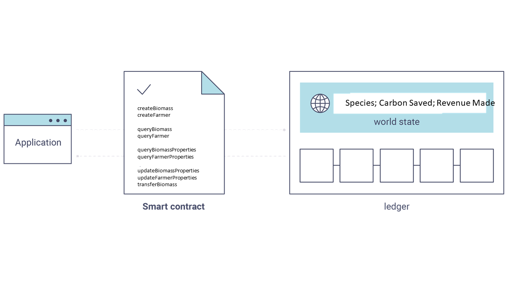

# Blockchain to maintain biomass data
Repository for Open Blockchain on Biomass, dubbed Biochain!
Our primary usecase has farmers as the primary stakeholder, who interact with the system to create biomass entries of surplus biomass they have in their farms.
We then dispatch a truck for collection of this biomass and reimburse the farmers for their trouble. The biomass is then processed and turned into gas, which is filtered and compressed into
gas cylinders similar to those used in domestic petroleum gas.

There are two primary mechanisms of interaction with Biochain: 
a. SMS: A farmer will be able to send and receive messages to and from the biochain system. We use Kannel, and open source SMS and WAP gateway for this interaction. The messaes are 
cached on a Postgres database for processing. Chaincode from the biochain system act on the messages and responses where necessary are made via the sms gateway. 
b. Web based interaction: Similar to the process flow above, only instead of SMS we directely interact with Biochain using JSON.  
  
Most of the farmers will opt to use the SMS version since their mobile device are better equiped for SMS and have little to no facility for web interaction.
Here is an overview of Biochain:

Please note Biochain is under development!

## Support/ Engagementno

We'd love to hear from you. You can post a comment or request for additional information using team-asr(at)as-research.org or visit www.as-research.org and use the contacts page.

## Licensing Terms:

Work and material herein is released under a GNU General Public License, and a Creative Commons Attribution 4.0 (CC-BY-4.0) License. Copies of license terms can be found here: https://www.gnu.org/licenses/gpl.html and https://creativecommons.org/licenses/by/4.0/
